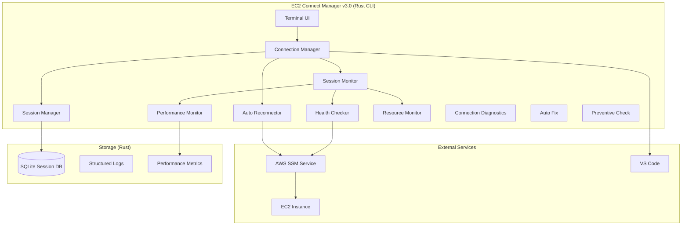

# 設計書

## 概要

EC2 Connect ツールのパフォーマンス最適化と自動セッション管理機能の改善を実装します。現在の v2.0 アーキテクチャを基盤として、自動セッション維持、高速再接続、セッション管理最適化、パフォーマンス監視、リソース使用量最適化、セッション状態管理、設定可能な再接続ポリシー、非同期処理による応答性向上、接続前診断、自動修復機能を実現します。

## アーキテクチャ

### 技術スタック選択

**Rust 完全移行による最適化:**

- **メモリ効率**: 目標使用量を 50MB から 10MB 以下に大幅削減
- **CPU 効率**: ゼロコスト抽象化による 1%以下の CPU 使用率達成
- **安全性**: メモリ安全性とスレッド安全性の保証
- **パフォーマンス**: ネイティブ実行による接続速度向上
- **CLI 専用**: GUI なしのターミナルベースインターフェース

**主要 Rust クレート:**

- **AWS SDK**: `aws-sdk-ssm`, `aws-sdk-ec2` for AWS API 操作
- **非同期処理**: `tokio` for async runtime
- **CLI**: `clap` for command line interface
- **設定管理**: `serde` + `toml`/`json` for configuration
- **ログ**: `tracing` for structured logging
- **ターミナル UI**: `crossterm` + `ratatui` for rich terminal interface
- **テスト**: `proptest` for property-based testing
- **データベース**: `rusqlite` for session state persistence

### 全体アーキテクチャ



    SM --> RM
    AR --> AWS
    SMgr --> DB
    PM --> METRICS
    HC --> AWS
    AWS --> EC2
    CM --> VS
    IM --> CM

````

### コンポーネント設計

#### 1. Session Monitor (セッション監視機能)

- **責務**: セッションの健全性を継続的に監視
- **機能**:
  - ハートビート監視（5 秒間隔）
  - ネットワーク活動監視
  - プロセス状態監視
  - タイムアウト予測

#### 2. Auto Reconnector (自動再接続機能)

- **責務**: セッション切断時の自動再接続
- **機能**:
  - 5 秒以内の切断検出
  - 指数バックオフ再接続（1s, 2s, 4s, 8s, 16s）
  - 設定可能な再接続ポリシー
  - 予防的セッション更新

#### 3. Session Manager (セッション管理機能)

- **責務**: 複数セッションの効率的管理
- **機能**:
  - セッション状態追跡
  - 既存セッション再利用提案
  - リソース使用量監視
  - 同時セッション制限（最大 3 つ）

#### 4. Performance Monitor (パフォーマンス監視機能)

- **責務**: 接続パフォーマンスの監視と最適化
- **機能**:
  - 接続時間測定
  - レイテンシ監視
  - 最適ルート選択
  - パフォーマンスレポート生成

#### 5. Health Checker (健全性チェッカー)

- **責務**: セッションとシステムの健全性確認
- **機能**:
  - SSM セッション応答確認
  - ネットワーク接続性テスト
  - リソース可用性チェック
  - 早期警告通知

#### 6. Resource Monitor (リソース監視機能)

- **責務**: システムリソース使用量の監視と最適化
- **機能**:
  - メモリ使用量監視（10MB制限）
  - CPU使用率監視（0.5%制限）
  - 低電力モード制御
  - リソース効率化

#### 7. Connection Diagnostics (接続診断機能)

- **責務**: 接続前のEC2インスタンスとSSM環境の包括的診断
- **機能**:
  - EC2インスタンス基本状態確認（実行中/停止中）
  - SSM管理インスタンス登録状況確認
  - IAM権限検証（SSM、EC2、IAM権限）
  - VPCエンドポイント設定確認
  - セキュリティグループ設定検証
  - 接続成功可能性評価（百分率表示）
  - 問題分類と優先度付け（CRITICAL/ERROR/WARNING/INFO）

#### 8. Auto Fix (自動修復機能)

- **責務**: 診断で発見された問題の自動修復
- **機能**:
  - インスタンス自動起動（ユーザー承認不要）
  - SSM登録待機と状態監視（デフォルト5分タイムアウト、3秒間隔チェック）
  - 登録進捗のリアルタイム表示
  - SSMエージェント状態確認・再起動
  - IAM権限設定手順提供
  - セキュリティグループ推奨設定提案
  - 修復結果検証と再評価

#### 9. Preventive Check (予防的チェック機能)

- **責務**: 接続失敗を事前に防ぐための包括的チェック
- **機能**:
  - 段階的検証（EC2→SSM→IAM→ネットワーク）
  - リアルタイム進捗表示
  - 問題の重要度分類
  - 接続成功確率算出
  - 詳細分析コマンド提案
  - 具体的修復推奨事項提供

## コンポーネントと インターフェース

### Session Monitor インターフェース

```rust
use tokio::time::Duration;
use std::collections::HashMap;

#[derive(Debug, Clone)]
pub struct SessionHealth {
    pub is_healthy: bool,
    pub last_activity: std::time::Instant,
    pub connection_count: u32,
    pub data_transferred: u64,
}

#[derive(Debug, Clone)]
pub enum SessionEvent {
    HealthDegraded(String),
    TimeoutPredicted(Duration),
    ActivityDetected,
    ConnectionLost,
}

pub trait SessionMonitor {
    async fn start_monitoring(&mut self, session_id: &str) -> Result<(), Box<dyn std::error::Error>>;
    async fn stop_monitoring(&mut self, session_id: &str) -> Result<(), Box<dyn std::error::Error>>;
    async fn check_session_health(&self, session_id: &str) -> Result<SessionHealth, Box<dyn std::error::Error>>;
    async fn predict_timeout(&self, session_id: &str) -> Result<Option<Duration>, Box<dyn std::error::Error>>;
    fn register_callback(&mut self, callback: Box<dyn Fn(SessionEvent) + Send + Sync>);
}
```

### Auto Reconnector インターフェース

```rust
use std::time::Duration;

#[derive(Debug, Clone)]
pub struct ReconnectionPolicy {
    pub enabled: bool,
    pub max_attempts: u32,
    pub base_delay: Duration,
    pub max_delay: Duration,
    pub aggressive_mode: bool,
    pub aggressive_attempts: u32,
    pub aggressive_interval: Duration,
}

pub trait AutoReconnector {
    async fn handle_disconnection(&mut self, session_id: &str, reason: &str) -> Result<bool, Box<dyn std::error::Error>>;
    async fn preemptive_reconnect(&mut self, session_id: &str) -> Result<bool, Box<dyn std::error::Error>>;
    fn configure_policy(&mut self, policy: ReconnectionPolicy);
    async fn attempt_reconnection(&mut self, session_id: &str, attempt: u32) -> Result<bool, Box<dyn std::error::Error>>;
}
```

### Session Manager インターフェース

```rust
use serde::{Deserialize, Serialize};

#[derive(Debug, Clone, Serialize, Deserialize)]
pub struct SessionConfig {
    pub instance_id: String,
    pub local_port: u16,
    pub remote_port: u16,
    pub aws_profile: Option<String>,
    pub region: String,
}

#[derive(Debug, Clone)]
pub struct ResourceUsage {
    pub memory_mb: f64,
    pub cpu_percent: f64,
    pub active_sessions: u32,
}

pub trait SessionManager {
    async fn create_session(&mut self, config: SessionConfig) -> Result<Session, Box<dyn std::error::Error>>;
    async fn find_existing_sessions(&self, instance_id: &str, port: u16) -> Result<Vec<Session>, Box<dyn std::error::Error>>;
    async fn suggest_reuse(&self, sessions: &[Session]) -> Option<Session>;
    async fn monitor_resource_usage(&self) -> Result<ResourceUsage, Box<dyn std::error::Error>>;
    async fn enforce_limits(&mut self) -> Result<(), Box<dyn std::error::Error>>;
}
```

### Connection Diagnostics インターフェース

```rust
use serde::{Deserialize, Serialize};

#[derive(Debug, Clone, Serialize, Deserialize)]
pub enum DiagnosticSeverity {
    Critical,
    Error,
    Warning,
    Info,
}

#[derive(Debug, Clone, Serialize, Deserialize)]
pub struct DiagnosticResult {
    pub check_name: String,
    pub severity: DiagnosticSeverity,
    pub message: String,
    pub recommendation: Option<String>,
    pub auto_fixable: bool,
}

#[derive(Debug, Clone)]
pub struct ConnectionLikelihood {
    pub percentage: u8,
    pub description: String,
    pub blocking_issues: Vec<String>,
}

pub trait ConnectionDiagnostics {
    async fn check_instance_state(&self, instance_id: &str) -> Result<DiagnosticResult, Box<dyn std::error::Error>>;
    async fn check_ssm_registration(&self, instance_id: &str) -> Result<DiagnosticResult, Box<dyn std::error::Error>>;
    async fn check_iam_permissions(&self, instance_id: &str) -> Result<Vec<DiagnosticResult>, Box<dyn std::error::Error>>;
    async fn check_vpc_endpoints(&self, instance_id: &str) -> Result<DiagnosticResult, Box<dyn std::error::Error>>;
    async fn check_security_groups(&self, instance_id: &str) -> Result<DiagnosticResult, Box<dyn std::error::Error>>;
    async fn evaluate_connection_likelihood(&self, results: &[DiagnosticResult]) -> ConnectionLikelihood;
    async fn run_full_diagnostics(&self, instance_id: &str) -> Result<Vec<DiagnosticResult>, Box<dyn std::error::Error>>;
}
```

### Auto Fix インターフェース

```rust
use std::time::Duration;

#[derive(Debug, Clone)]
pub enum FixResult {
    Success(String),
    Failed(String),
    RequiresManualIntervention(String),
    RequiresUserApproval(String),
}

#[derive(Debug, Clone)]
pub struct SsmRegistrationStatus {
    pub is_registered: bool,
    pub ping_status: Option<String>,
    pub last_ping_time: Option<std::time::SystemTime>,
    pub agent_version: Option<String>,
}

#[derive(Debug, Clone)]
pub struct WaitProgress {
    pub elapsed_seconds: u64,
    pub max_wait_seconds: u64,
    pub current_status: String,
    pub check_count: u32,
}

pub trait AutoFix {
    async fn fix_instance_state(&mut self, instance_id: &str) -> Result<FixResult, Box<dyn std::error::Error>>;
    async fn wait_for_ssm_registration(&mut self, instance_id: &str, timeout: Duration) -> Result<SsmRegistrationStatus, Box<dyn std::error::Error>>;
    async fn register_wait_progress_callback(&mut self, callback: Box<dyn Fn(WaitProgress) + Send + Sync>);
    async fn fix_ssm_agent(&mut self, instance_id: &str) -> Result<FixResult, Box<dyn std::error::Error>>;
    async fn suggest_iam_fixes(&self, instance_id: &str) -> Result<Vec<String>, Box<dyn std::error::Error>>;
    async fn suggest_security_group_fixes(&self, instance_id: &str) -> Result<Vec<String>, Box<dyn std::error::Error>>;
    async fn verify_fix(&self, instance_id: &str, fix_type: &str) -> Result<bool, Box<dyn std::error::Error>>;
}
```

### Preventive Check インターフェース

```rust
#[derive(Debug, Clone)]
pub struct PreventiveCheckProgress {
    pub current_step: String,
    pub total_steps: u8,
    pub current_step_number: u8,
    pub step_results: Vec<DiagnosticResult>,
}

pub trait PreventiveCheck {
    async fn run_preventive_checks(&mut self, instance_id: &str) -> Result<Vec<DiagnosticResult>, Box<dyn std::error::Error>>;
    async fn register_progress_callback(&mut self, callback: Box<dyn Fn(PreventiveCheckProgress) + Send + Sync>);
    async fn get_detailed_analysis_commands(&self, instance_id: &str) -> Vec<String>;
    async fn get_fix_recommendations(&self, results: &[DiagnosticResult]) -> Vec<String>;
}
```

## データモデル

### Session モデル

```rust
use serde::{Deserialize, Serialize};
use std::time::{SystemTime, Instant};

#[derive(Debug, Clone, Serialize, Deserialize)]
pub struct Session {
    pub id: String,
    pub instance_id: String,
    pub local_port: u16,
    pub remote_port: u16,
    pub status: SessionStatus,
    pub created_at: SystemTime,
    pub last_activity: SystemTime,
    pub process_id: Option<u32>,
    pub connection_count: u32,
    pub data_transferred: u64,
}

#[derive(Debug, Clone, Serialize, Deserialize)]
pub enum SessionStatus {
    Connecting,
    Active,
    Inactive,
    Reconnecting,
    Terminated,
}
```

### Performance Metrics モデル

```rust
use serde::{Deserialize, Serialize};
use std::time::SystemTime;

#[derive(Debug, Clone, Serialize, Deserialize)]
pub struct PerformanceMetrics {
    pub session_id: String,
    pub connection_time: f64,
    pub latency: f64,
    pub throughput: f64,
    pub cpu_usage: f64,
    pub memory_usage: f64,
    pub timestamp: SystemTime,
}
```
    enabled: bool = True
    max_attempts: int = 5
    base_delay: float = 1.0
    max_delay: float = 16.0
    aggressive_mode: bool = False
    aggressive_attempts: int = 10
    aggressive_interval: float = 0.5
```

## 正確性プロパティ

_プロパティは、システムのすべての有効な実行において真であるべき特性や動作の形式的な記述です。プロパティは人間が読める仕様と機械で検証可能な正確性保証の橋渡しとなります。_

### プロパティ分析

### プロパティ反映

冗長性排除後の最適化されたプロパティセット：

**統合されたプロパティ:**

- セッション監視継続性 (1.1 + 1.5)
- 予防的セッション管理 (1.2 + 1.3)
- 指数バックオフ再接続 (1.4 = 2.3)
- 自動切断検出・再接続 (2.1 + 2.2)
- リソース使用量制限 (5.1 + 5.2)
- 省電力モード制御 (5.4 + 5.5)
- UI 応答性維持 (8.1 + 8.3)
- 非同期処理統一 (8.2 + 8.5)

### 正確性プロパティ

プロパティ 1: セッション監視継続性
_任意の_ SSM セッションについて、セッション確立からユーザーの明示的切断要求まで、セッション監視機能は健全性チェックを継続的に実行する
**検証: 要件 1.1, 1.5**

プロパティ 2: 予防的セッション管理
_任意の_ アクティブセッションについて、切断リスクまたはタイムアウト予測時に、システムは予防的にセッション更新または新規セッション確立を実行する
**検証: 要件 1.2, 1.3**

プロパティ 3: 指数バックオフ再接続
_任意の_ 再接続失敗について、システムは指数バックオフパターン（1 秒、2 秒、4 秒、8 秒、16 秒）で再試行間隔を設定する
**検証: 要件 1.4, 2.3**

プロパティ 4: 高速切断検出と自動再接続
_任意の_ 予期しないセッション終了について、システムは 5 秒以内に切断を検出し、ユーザー介入なしに即座に再接続を試行する
**検証: 要件 2.1, 2.2**

プロパティ 5: 再接続後状態復旧
_任意の_ 成功した再接続について、セッション監視機能はデータ損失なしに通常監視を再開し、セッション状態の整合性を維持する
**検証: 要件 2.4**

プロパティ 6: 最終失敗時通知
_任意の_ 全再接続試行失敗について、システムはユーザーに通知し、手動再接続オプションを提供する
**検証: 要件 2.5**

プロパティ 7: 既存セッション確認と再利用提案
_任意の_ 新規セッション要求について、同一インスタンス・同一ポートの健全な既存セッションが存在する場合、システムは再利用を提案する
**検証: 要件 3.1, 3.2**

プロパティ 8: セッション非アクティブ判定
_任意の_ セッションについて、以下の条件を満たす場合にシステムは非アクティブと判定する：ローカルポート新規接続なし 30 秒、データ転送なし 30 秒、SSM プロセス応答なし 5 秒
**検証: 要件 3.3**

プロパティ 9: 複数セッションリソース監視
_任意の_ 複数同時アクティブセッションについて、システムはリソース使用量を監視し、必要に応じて警告を表示する
**検証: 要件 3.4**

プロパティ 10: 同時セッション制限
_任意の_ インスタンスについて、システムは同時セッション数を最大 3 つに制限し、制限超過時は適切な処理を実行する
**検証: 要件 3.5**

プロパティ 11: パフォーマンス測定と記録
_任意の_ 接続確立について、システムは接続時間を測定・記録し、パフォーマンス統計を維持する
**検証: 要件 4.1, 4.5**

プロパティ 12: レイテンシ最適化
_任意の_ 接続について、レイテンシが 200ms を超える場合、システムは接続最適化を試行し、複数パス利用可能時は最速ルートを選択する
**検証: 要件 4.2, 4.3**

プロパティ 13: パフォーマンス劣化対応
_任意の_ パフォーマンス劣化検出について、システムは詳細メトリクスをログに記録し、分析情報を提供する
**検証: 要件 4.4**

プロパティ14: リソース使用量制限（Rust最適化）
*任意の* システム実行状態について、RAM使用量は10MB以下、セッション監視時のCPU使用率は平均0.5%以下を維持する
**検証: 要件5.1, 5.2**

プロパティ 15: リソース効率化
_任意の_ 複数セッション実行時について、システムはメモリを効率的に共有し、総使用量を最小化する
**検証: 要件 5.3**

プロパティ 16: 省電力モード制御
_任意の_ アイドル状態またはバックグラウンド実行について、システムは監視頻度を下げ、低電力モードに移行してリソース消費を削減する
**検証: 要件 5.4, 5.5**

プロパティ 17: リアルタイム状態更新
_任意の_ セッション状態変更について、システムは 1 秒以内に表示を更新し、複数セッション時は統合状態情報を提供する
**検証: 要件 6.1, 6.4**

プロパティ 18: 進捗表示と早期警告
_任意の_ 再接続進行中またはセッション健全性劣化について、システムは明確な進捗インジケーターまたは早期警告通知を提供する
**検証: 要件 6.2, 6.3**

プロパティ 19: セッション状態永続化
_任意の_ セッション状態について、システムはアプリケーション再起動に耐える永続化を実行し、状態の継続性を保証する
**検証: 要件 6.5**

プロパティ 20: 設定可能再接続ポリシー
_任意の_ 再接続設定について、システムは再試行間隔・最大試行回数・アグレッシブモード・自動再接続有効/無効のカスタマイズを許可し、設定に従って動作する
**検証: 要件 7.1, 7.2, 7.3, 7.4, 7.5**

プロパティ 21: UI 応答性維持
_任意の_ 接続操作進行中またはユーザー入力について、システムは UI 応答性を維持し、バックグラウンド操作に関係なく 100ms 以内に応答する
**検証: 要件 8.1, 8.3**

プロパティ 22: 非同期処理と優先度制御
_任意の_ 長時間操作・I/O 操作について、システムは非同期処理を使用してブロッキングを防ぎ、複数操作同時実行時はユーザー向け操作を優先する
**検証: 要件 8.2, 8.4, 8.5**

プロパティ 23: 接続前診断実行
_任意の_ 接続要求について、システムはEC2インスタンスの基本状態確認、SSM登録状況確認、IAM権限・VPCエンドポイント・セキュリティグループ設定検証を順次実行する
**検証: 要件 9.1, 9.2, 9.3**

プロパティ 24: 診断結果報告
_任意の_ 診断完了について、システムは接続成功可能性を百分率で表示し、検出された問題を重要度で分類して報告する
**検証: 要件 9.4**

プロパティ 25: 重大問題対応
_任意の_ 重大問題検出について、システムは接続を中止し、修復提案を提供する
**検証: 要件 9.5**

プロパティ 26: 自動修復実行
_任意の_ 修復可能問題について、システムは適切な修復動作（インスタンス自動起動、SSMエージェント再起動、権限設定手順提供、セキュリティグループ推奨設定提案）を実行する
**検証: 要件 10.1, 10.6, 10.7, 10.8**

プロパティ 27: インスタンス起動後SSM登録待機
_任意の_ 停止インスタンス起動について、システムはSSM管理インスタンスとして登録されるまで3秒間隔で定期的に確認し、待機状況と経過時間を表示する
**検証: 要件 10.2, 10.3**

プロパティ 28: SSM登録完了後接続試行
_任意の_ SSM登録完了について、システムは接続可能状態を確認し、セッション確立を試行する
**検証: 要件 10.4**

プロパティ 29: SSM登録タイムアウト処理
_任意の_ SSM登録待機について、一定時間（デフォルト5分）経過しても完了しない場合、システムはタイムアウトエラーを報告し、トラブルシューティング手順を提供する
**検証: 要件 10.5**

プロパティ 30: 修復結果検証
_任意の_ 修復操作完了について、システムは修復結果を検証し、接続可能性を再評価する
**検証: 要件 10.9**

プロパティ 31: 予防的チェック包括性
_任意の_ 予防的チェック実行について、システムはEC2インスタンス、SSM、IAM、ネットワーク設定を段階的に検証し、各段階で進捗状況をリアルタイム表示する
**検証: 要件 11.1, 11.2**

プロパティ 32: 問題分類と成功確率算出
_任意の_ 予防的チェック完了について、システムは問題を重要度で分類表示し、検出された問題に基づいて接続成功確率を算出する
**検証: 要件 11.3, 11.4**

プロパティ 33: 分析コマンドと推奨事項提供
_任意の_ 予防的チェック結果について、システムは詳細分析コマンドを提案し、問題解決のための具体的な推奨事項を提供する
**検証: 要件 11.5**

## エラーハンドリング

### エラー分類と対応

#### 1. 接続エラー

- **AWS 認証エラー**: 認証情報の再確認と更新提案
- **ネットワークエラー**: 接続経路の診断と代替ルート提案
- **SSM サービスエラー**: サービス状態確認と待機推奨

#### 2. セッションエラー

- **セッション作成失敗**: リソース確認と制限調整提案
- **セッション切断**: 自動再接続とユーザー通知
- **セッション応答なし**: ヘルスチェック強化と警告表示

#### 3. リソースエラー

- **メモリ不足**: 不要セッション終了と警告表示
- **CPU 過負荷**: 監視頻度調整と省電力モード移行
- **ディスク容量不足**: ログローテーションと容量確保

#### 4. 設定エラー

- **設定ファイル破損**: デフォルト設定復旧と修復提案
- **無効な設定値**: 検証エラー表示と修正提案
- **権限エラー**: 権限確認と設定手順提示

### エラー回復戦略

#### 自動回復

- 一時的なネットワークエラー: 指数バックオフ再試行
- セッション切断: 自動再接続
- リソース不足: 自動クリーンアップ

#### 半自動回復

- 設定エラー: 修正提案とユーザー確認
- 権限エラー: 解決手順提示
- サービスエラー: 代替手段提案

#### 手動回復

- 重大な設定破損: 完全リセット提案
- システムレベルエラー: 管理者介入要求
- 互換性問題: アップデート推奨

## テスト戦略

### 二重テストアプローチ

#### 単体テスト

- **具体例テスト**: 特定のシナリオと境界値
- **エラー条件テスト**: 各種エラー状況の処理
- **統合ポイントテスト**: コンポーネント間の連携

#### プロパティベーステスト

- **汎用プロパティテスト**: 全入力に対する普遍的特性
- **ランダム化テスト**: 大量の入力パターンでの包括的カバレッジ
- **最小 100 回反復**: ランダム化による十分な検証

### テスト設定要件

#### プロパティテスト設定

- **最小反復回数**: 100 回（ランダム化による）
- **タグ形式**: **Feature: ec2-connect-improvements, Property {number}: {property_text}**
- **各プロパティ**: 単一のプロパティベーステストで実装
- **設計文書参照**: 各テストは対応する設計プロパティを参照

#### テストライブラリ

- **Rust**: `proptest` 1.0+を使用
- **プロパティテスト**: 汎用特性の検証
- **単体テスト**: 具体例とエッジケース
- **統合テスト**: エンドツーエンドフロー
- **ベンチマーク**: `criterion` でパフォーマンス測定
````
